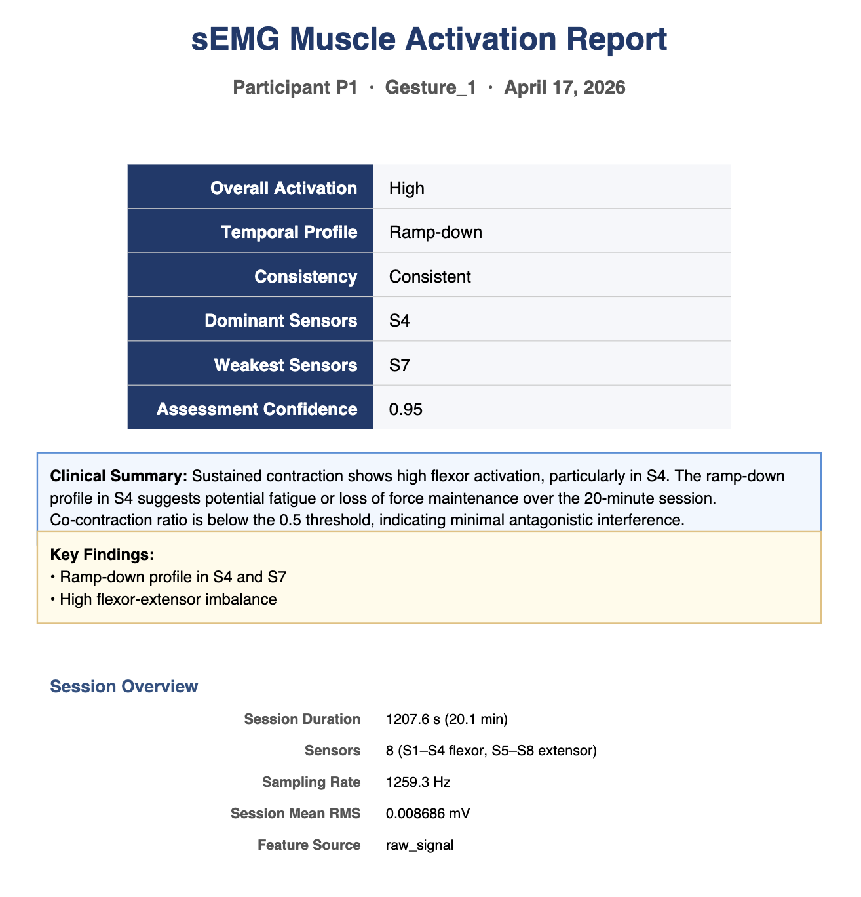
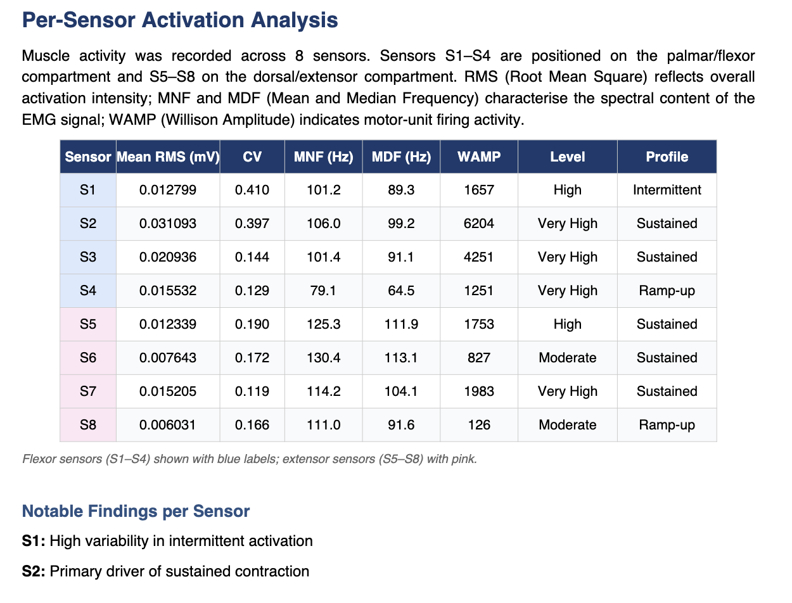
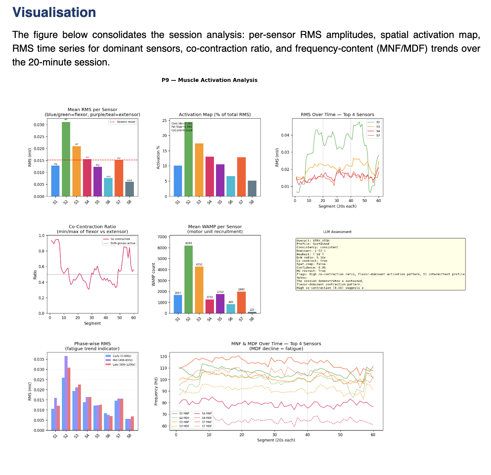

# sEMG Signal Interpretation Using LLMs

Independent Project, Winter '26.

Clinical interpretation of surface electromyography (sEMG) recordings using a
retrieval-augmented LLM pipeline. The system ingests raw 8-sensor forearm EMG,
extracts time- and frequency-domain features per 20-second window, grounds the
LLM with clinical rules and research-paper context, and produces a structured
muscle-activation assessment plus a physician-facing PDF report.


**Sample output:** [P1 clinical report (PDF)](results/reports/P1_activation_report.pdf)




---

## 1. What this project does

For each participant (P1–P9) performing a sustained power-grip gesture
(`Gesture_1`, ~20 min, 8 Delsys Avanti sensors, ~1259 Hz):

1. **Filter** the raw ~680 MB CSV down to the 8 EMG channels + timestamps.
2. **Extract features** per 20 s window (60 windows total):
   - Time-domain: RMS, MAV, IEMG, Waveform Length, Zero Crossings, Slope Sign
     Changes, Willison Amplitude, Peak Amplitude, Variance.
   - Frequency-domain: Mean Frequency (MNF), Median Frequency (MDF), Total
     Power (via FFT after 20–450 Hz Butterworth band-pass).
   - Cross-channel: activation map, concentration index, pattern stability,
     inter-channel correlation, co-contraction ratio, flexor/extensor balance.
   - Short-window (250 ms) envelope + onset/offset/duty-cycle detection
     (automatically skipped for sustained-contraction recordings).
3. **Build an LLM prompt** that combines:
   - A system instruction and strict JSON output schema.
   - Hand-curated clinical rules (`rag/rules.py`: A1–A13 activation rules,
     P1–P7 physiological context).
   - RAG context: top-k chunks retrieved from a ChromaDB vectorstore over five
     peer-reviewed EMG papers (`Activation/*.pdf`).
   - The computed session feature summary.
4. **Call the LLM** (Gemini by default, Groq optional) with retries + robust
   JSON extraction to obtain a structured activation assessment.
5. **Evaluate and visualise**: per-participant PNG plots, a summary CSV, a
   Markdown report, and a physician-facing PDF report per participant plus a
   combined report.

---

## 2. Repository layout

```
.
├── Activation/                  Research-paper PDFs used as RAG corpus
├── DATA/                        One folder per participant (P1..P9)
│   └── P{N}/
│       ├── Gesture_1.csv        Filtered 8-channel raw EMG (gitignored, ~256 MB)
│       ├── features_long.csv    60 × (12 features × 8 sensors + cross-channel)
│       ├── features_short.csv   ~4800 × envelope per sensor (250 ms windows)
│       ├── activation_features.json   Session summary consumed by the LLM
│       ├── activation_prompt.txt      Rendered LLM prompt
│       └── activation_result.json     Parsed LLM assessment
├── rag/
│   ├── build_index.py           PDF → chunks → embeddings → ChromaDB
│   ├── retriever.py             Semantic retrieval (ChromaDB, TF-IDF fallback)
│   ├── rules.py                 Clinical rules embedded in prompts
│   ├── knowledge_base.json      TF-IDF fallback corpus
│   ├── rules.json               Machine-readable rule set
│   └── vectorstore/             Built ChromaDB index (gitignored)
├── results/
│   ├── activation_plots/        Per-participant PNG dashboards
│   ├── activation_summary.csv   Flat summary across all participants
│   ├── activation_report.md     Markdown report
│   └── reports/                 Per-participant + combined PDFs
├── scripts/
│   ├── filter_raw_emg.py              Stage 0: shrink raw CSV to EMG-only
│   ├── extract_activation_features_full.py   Stage 1: feature extraction
│   ├── generate_activation_prompts.py        Stage 2: RAG + prompt assembly
│   ├── predict_activation.py                 Stage 3: LLM call
│   ├── evaluate_activation.py                Stage 4: plots + summary
│   └── generate_pdf_report.py                Stage 5: clinical PDF reports
├── project_spec.pdf             Original project specification
├── requirements.txt
├── .env.example                 Copy to .env and fill in API keys
└── README.md
```

---

## 3. Setup

```bash
python3 -m venv .venv
source .venv/bin/activate
pip install -r requirements.txt
cp .env.example .env            # then edit .env with your GEMINI_API_KEY / GROQ_API_KEY
```

### Data

Raw per-participant CSVs are not checked in (~256 MB each). Place them at
`DATA/P{N}/Gesture_1.csv`. If you have the original unfiltered 680 MB source
dumps in a `raw_g1/` folder named `1.csv`, `2.csv`, …, run:

```bash
python3 scripts/filter_raw_emg.py            # filters all participants
python3 scripts/filter_raw_emg.py 1 3 5      # filters specific ones
```

### RAG index

The ChromaDB vectorstore is rebuilt from the PDFs in `Activation/`:

```bash
python3 rag/build_index.py          # skip if already built
python3 rag/build_index.py --force  # rebuild from scratch
```

If the vectorstore is unavailable, `retriever.py` transparently falls back to
TF-IDF over `rag/knowledge_base.json`.

---

## 4. End-to-end pipeline

Run the five stages in order. Each script supports a specific participant as
its first argument (e.g. `P3`) or processes all discovered participants by
default.

```bash
# 1. Feature extraction from filtered raw EMG
python3 scripts/extract_activation_features_full.py

# 2. Build prompts (RAG + rules + features)
python3 scripts/generate_activation_prompts.py

# 3. LLM prediction  (default: Gemini; use --model groq for Llama-3.1 on Groq)
python3 scripts/predict_activation.py
python3 scripts/predict_activation.py --model groq

# 4. Plots, summary CSV, Markdown report
python3 scripts/evaluate_activation.py

# 5. Clinical PDF reports (per-participant + combined)
python3 scripts/generate_pdf_report.py
```

Outputs from stages 1–3 land under `DATA/P{N}/`; stages 4–5 write under
`results/`.

---

## 5. Design notes

- **Sensor layout.** S1–S4 are palmar/flexor; S5–S8 are dorsal/extensor.
  Flexor/extensor balance and co-contraction ratio are computed from this
  split.
- **Sustained-contraction handling.** When the opening 5 s baseline is already
  at >50 % of the session mean envelope, the gesture is flagged as sustained
  and onset/offset/duty-cycle outputs are suppressed rather than fabricated.
  The LLM prompt communicates this explicitly so the model does not invent
  timing data.
- **No %MVC normalisation.** Amplitudes are absolute mV. Per rule A13/P6,
  cross-subject amplitude comparisons are avoided in the generated reports.
- **LLM grounding.** The prompt includes the rule text verbatim, RAG-retrieved
  paper chunks selected per detected signal flags (crosstalk, co-contraction,
  MU recruitment, etc.), and the full numerical session summary. Output is a
  strict JSON schema; regex fallback recovers malformed responses.
- **Model choice.** Gemini (`gemini-3.1-flash-lite-preview`) by default;
  Groq (`llama-3.1-8b-instant`) as an alternative. Both are configured for
  `temperature=0.1, max_tokens=1800` with two JSON-parse retries.

---

## 6. References

- Konrad P. (2005). *The ABC of EMG.*
- Nazmi N. et al. (2016). *A Review of Classification Techniques of EMG
  Signals during Isotonic and Isometric Contractions.*
- Phinyomark A. et al. (2012). *Mean and Median Frequency of EMG Signal.*
- Vigotsky A. et al. (2018). *Interpreting Signal Amplitudes in Surface EMG
  Studies.*
- Yang J. et al. (2024). *EMGBench: Benchmarking OOD Generalization and
  Adaptation for Electromyography.* NeurIPS.
